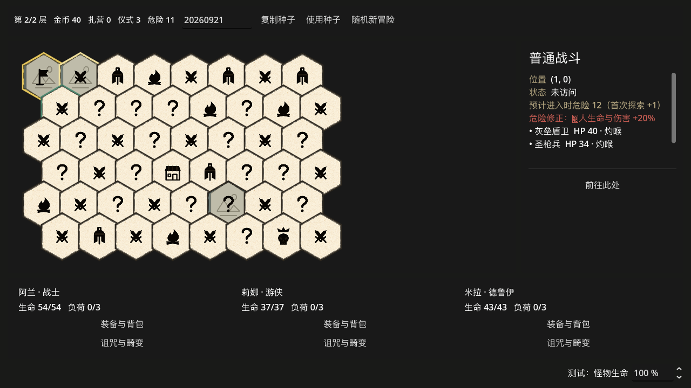

# 六边形大地图重构：实施与验证记录

日期：2026-09-21。当前工作区，基线提交 `958d5ee`；本轮不提交、不推送。

后续记录：用户已授权提交前再审查、修复后提交推送；追加发现和修复见 [提交前独立审查](2026-09-21-hex-overworld-code-review.md)。下文的“未提交”描述初次实施交付时的状态。

## 实施范围

- 完全替换旧四向道路地图：默认 48 格，可配置 40～55 格，共边即相邻。每格独立 `AdventureRoomState` Resource 与 `AdventureHexTile` 场景节点。
- 所有背面可见；问号不泄露真实类型。首次探索增加危险并自动触发内容；已探索路径通行免费。
- 危险按地图独立累计，数值档位为 0/10/20/40/60%；危险畸变、增援与形态转换使用同一适配服务；6/12 阈值按规则标记高价值背面。
- 营地侦察选择范围 3 内至多 2 格；三项危险18事件替换为仅卡牌奖励战斗。
- 两家商店使用整局独立 RNG 字符串状态；查看不重抽，物理重访后可明确补货，最多两次。
- 新存档槽 `adventure_hex_run`、schema 7；旧 `adventure_run` 不迁移、不覆盖，必须明确开始新局。未来版本档拒绝载入或覆盖；损坏主档只回退兼容备份。
- 羊皮纸底纹、独立 SVG 类型符号、透明黑色毛笔边框已接入；正面使用简单占位图。

## 模块职责

| 职责 | 文件（位于 scripts/adventure） |
|---|---|
| 每格状态、几何、生成、校验 | room_state / hex_geometry / content_allocator / map_generator / map_validator |
| 危险阈值、路径、侦察、移动事务 | danger_service / travel_service / reveal_service / map_operation_service |
| 库存与独立随机流 | shop_service / shop_stock_factory |
| 固定遭遇、事件变体、战斗组装与预览 | encounter_content / event_variant_service / battle_setup_service / battle_scenario_builder / encounter_preview_service |
| 敌人数值与畸变 | battle_danger_service / battle_danger_mutation_pool |
| 图格、容器、信息过滤、侦察选择 | hex_tile / map_view / map_presentation / scout_picker |
| 存档格式与文件轮转 | save_schema / save_store |

`adventure_session.gd` 保留流程协调；`BattleController` 只增加战斗入口、增援与共同伤害入口的薄接线，没有承载整套地图规则。

## 验证

环境：本机 Godot 4.7.2 Steam，诊断使用独立存档槽；Godot 在获批的沙箱外环境运行。

- 52 个非视觉诊断逐场景退出码 0，输出各自 PASS/completed 标记（移动性能诊断输出正常耗时结果）。包括原有职业、卡牌、意图、战斗、装备及更新后的冒险诊断。
- 地图全组合：40～55 格 × 两章 × 100 个种子，共 3,200 个地图；分四段运行，均 `ADVENTURE_HEX_MAP_CHECK: PASS`。
- 两个种子、每个两章的自动化旅程：探索、营地侦察、商店离开/重访补货、危险最高档、首领、换图及锁定战斗存档 round-trip，`HEX_JOURNEY: PASS`。
- 危险战斗诊断执行真实鱼人逆位、腐心阶段转换、圣骑合体及血肉造物召唤；检查生命倍率单次向上取整、最高血量目标、增援词缀和形态保持。
- 存档诊断覆盖旧档字节不变、未来版本拒绝、损坏主档/唯一有效备份、移动与补货中断重放、RNG 字符串 round-trip。
- 事件诊断覆盖三个危险18事件、仅卡牌奖励、领取/跳过一次性、战败无奖励、读档及原效果不触发。
- 商店诊断覆盖两店访问顺序、跨图连续、战斗/侦察随机独立、两次补货上限、已售商品保留以及多商品类别。
- 扩展后的预览诊断 `ENCOUNTER_PREVIEW: PASS`：普通战斗 5→6、11→12、17→18，以及三事件各自 17→18，预览词缀、HP、伤害加成与真实 Session 开战 payload 一致；已锁定战斗不随地图当前危险变化。
- 真实 Compatibility/GPU 渲染 `HEX_VISUAL: PASS`：1280×720 与 900×720、48 个独立节点、透明角拒绝点击、未揭示商店不泄漏、底栏和详情不溢出、第二章侦察和危险预览。已人工查看生成截图。
- 最终合计 54 个非视觉场景（52 个逐项回归，加地图生成与旅程），另加六边形地图真实 GPU 视觉场景；功能诊断无 SCRIPT ERROR、Parse Error 或失败断言。Godot 编辑器导入与 `git diff --check` 通过。

完整本机运行日志：`/private/tmp/mydeck-hex-final.TK4TYW`（临时目录，不是项目交付文件）。

## 审查与修复

Terra 子智能体按互不重叠的文件职责实施，并交叉审查。审查中修复了存档备份轮转、重放增援分配、生命滑杆双重取整导致最高血量选错、事件奖励事务重入、补货只选首个候选、图格符号纹理生命周期及窄窗口底栏裁切等问题。最后的危险18事件预览和文件系统错误返回修复也已独立复核；当前无已知必须先修复的审查项。

## 真实截图与美术

- [1280×720 地图](hex-overworld/map_1280.png)
- [900×720 窄窗口与隐藏商店](hex-overworld/map_narrow.png)
- [第二章事件详情](hex-overworld/map_chapter2_scout.png)
- [跨入危险12的敌人预览](hex-overworld/map_danger_preview.png)
- [黑色笔触边框组合预览](../../../assets/art/adventure/hex_tiles/brush_preview.png)
- [透明独立边框](../../../assets/art/adventure/hex_tiles/brush_border.png)

## 已知限制

- 原有诊断仍报告退出时 ObjectDB、Resource 与纹理 RID 未释放；本轮未清理该历史问题。不能将退出码 0 解释为没有任何警告。
- 自动化旅程直接构造战斗胜利结果推进流程，不等同于人工打完两章，也不证明当前数值平衡；战斗机制另有真实控制器诊断。
- 正面插画是占位；黑色笔触边框和背面底纹是正式接入的独立资源。
- 不支持继续游玩旧架构存档，但旧文件保留；新档槽隔离。
- 未提交、未推送。未提交审查记录保留在 `.superpowers/sdd/2026-09-21-hex-overworld-rebuild/`，不在没有 git 历史替代的情况下删除。
