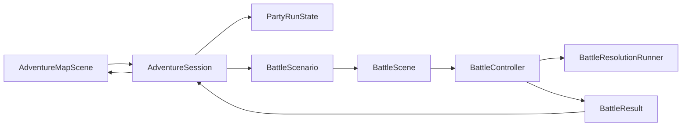

# 项目结构与 Skill 工作流

更新时间：2026-07-17

本文档记录项目当前工程结构、运行时数据所有权、核心结算路径、测试入口以及在 Codex 中使用 GodotPrompter Skill 的方法。设计数值仍以外部设计文档为目标，实际实现状态以代码、资源和诊断为准。

## 当前可运行范围

- 当前验证环境：Steam 版 Godot `4.7.1-stable`；具体路径见 `environment_memory.md`。
- 主入口：两层冒险 Demo，大地图为 `11x7` 方形布局上的房间图。
- 可操控职业：战士、游侠、德鲁伊。
- 战斗地图：六边形网格、`Vector2i` 格坐标、整数距离和整数移动费用。
- 已接入框架：卡牌、装备、状态、诅咒、地表元素、职业资源、第一章怪池与公开意图、商店、奖励、营地、事件、存档和战斗结果回写。
- 当前自动存档：`user://adventure_run.json`，并使用临时文件和备份文件提交。

## 运行流程

1. `AdventureMapScene` 只负责地图与模态 UI，操作统一提交给 `AdventureSession`。
2. `AdventureSession` 是唯一 Autoload，管理冒险状态、事务、场景切换、奖励和存档。
3. 进入战斗前构造 `BattleScenario`，战斗中的角色状态从持久 `CharacterState` 深复制为运行时状态。
4. `BattleController` 管理部署、回合、行动、卡牌、伤害、地表和结果提交。
5. 战斗结束生成 typed `BattleResult`，白名单回写生命、诅咒、游侠元素及冒险期修正，再返回大地图。

## 目录与职责

| 模块 | 当前职责 | 关键入口 |
| --- | --- | --- |
| `scripts/adventure/` | 地图生成、房间、经济、事件、奖励、事务和 JSON 存档 | `adventure_session.gd`、`adventure_map_generator.gd` |
| `scripts/battle/` | 战斗领域、六边网格、目标、寻路、行动队列、打击与 UI 适配 | `battle_controller.gd`、`battle_resolution_runner.gd` |
| `scripts/cards/` | 卡牌配置接口、效果、条件、职业牌和选择模式 | `card_data.gd`、`card_effect.gd` |
| `scripts/characters/` | 角色模板、冒险持久状态、装备栏、牌组与职业资源 | `character_state.gd` |
| `scripts/items/` | 装备配置、成对或双面组件、运行时状态和装备 hook | `equipment_data.gd`、`equipment_runtime_state.gd` |
| `scripts/curses/` | 业、报、果实例，负荷、成熟度和队伍冒险状态 | `curse_instance.gd`、`party_run_state.gd` |
| `scripts/enemies/` | 怪物数据、分类牌组、第一章遭遇、特性和公开意图 | `chapter_one_enemy_catalog.gd`、`enemy_intent_planner.gd` |
| `scripts/status/` | 护甲、眩晕、职业状态和通用 hook | `status_effect.gd` |
| `resources/` | 卡牌、角色、敌人、装备、诅咒和战斗配置 | `.tres` 文件 |
| `scenes/` | 大地图和战斗组合根 | `adventure_map_scene.tscn`、`battle_scene.tscn` |
| `tools/diagnostics/` | 无头专项回归 | `*_check.tscn` |

当前脚本主要集中在卡牌和状态模块；新增逻辑应优先复用基础接口，避免在 `BattleController` 继续堆叠只服务单张牌的分支。

## 数据所有权

### 静态配置

以下 Resource 是共享设计数据，运行时不得直接改写：

- `CardData`、`CardEffect`
- `EquipmentData`、`EquipmentEffect`
- `CharacterData`、`EnemyData`
- `CurseDefinition`
- `BattleConfig`、`BattleMapData`

### 冒险持久状态

- `PartyRunState`：种子、楼层、金币、补给、扎营点、仪式点、队伍和待处理事务。
- `CharacterState`：生命、牌组、装备实例、背包、诅咒、元素库存及冒险期修正。
- `CardStack.stack_id` 与装备实例 ID：承载单件牌或装备的冒险期修改。

### 战斗运行时状态

- `BattleUnitState`：坐标、AP、手牌与各牌区、状态、形态、职业战斗资源。
- `EquipmentRuntimeState`：层数、冷却、弹仓、风向、准备次数等单场状态。
- 卡牌运行时 Dictionary：临时减费、来源牌区、临时放逐和单场标记。
- `BattleSurfaceState`：本场地表元素与高级地表期限。
- `EnemyState`：敌人阶段、当前武器、特性计数器、已见牌和实例独占意图。

共享 `.tres` 上禁止保存余烬、势、成熟度、弹仓、预设模式或临时伤害加值，否则多个角色和多场战斗会共享错误状态。

## 战斗架构

### 回合与行动

`BattleController` 使用 `Phase` 和 `TurnFlowState` 表达部署、回合开始、行动阶段、回合结束与战斗结束。玩家命令和 AI 决策都必须经过控制器领域入口。

行动序是每轮快照：新轮开始读取当前敏捷并排序，轮内锁定；当前轮的敏捷变化只影响下一轮。敌人使用锁定的 `EnemyIntentPlan` 执行，不在步骤失效后重新规划强牌。

`BattleResolutionRunner` 管理两层队列：

- 主要行动 FIFO：出牌、普通移动、普通攻击、回合开始和回合结束。
- 当前行动的效果队列：卡牌子效果、状态 hook、装备 hook 和 trigger，按优先级后按入队顺序结算。

不要在卡牌或状态回调中递归调用另一张牌的 `play()`。需要产生新主要行动时，提交新的 `BattleActionFrame`；只属于当前行动的后续效果使用 `enqueue_effect()` 或 `enqueue_trigger()`。

完整规则见 [battle_resolution_notes.md](battle_resolution_notes.md)。

### 卡牌

- `CardData` 保存 AP、类型、目标、范围、标签、职业、正逆位和特殊条件。
- `CardEffect` 提供 `can_play`、费用支付、目标验证、结算和特殊区 hook。
- 卡牌移动、二段落点等预览应提供批量合法格查询，避免 UI 对每格重复执行完整寻路。
- 伤害牌应通过控制器或 `BattleStrikeResolver` 结算，不直接修改目标生命。
- 多段伤害逐段应用伤害加值、减免和护甲。

### 装备

- 一个装备栏可保存成对组件或双面组件。
- 成对武器通过明确模式选择组件；双面德鲁伊武器由形态投影当前面。
- 打击统一先构建 `StrikeProfile`，再由 `BattleStrikeResolver` 结算。
- 装备事件通过 `EquipmentEffect` hook 进入统一流程，不在卡牌脚本复制装备规则。

### 地图与移动

- `BattleHexGrid` 是六边距离、邻居和直线的唯一数学入口。
- `BattlePathfinder` 处理普通移动路径及地表费用。
- 普通移动、按路径卡牌移动、直线移动、特殊转移和强制移动是不同语义，预览与结算必须复用同一规则。
- `BattleMapView` 只负责绘制和输入转发，不拥有合法性规则。

### 通用 hook

当前 hook 覆盖抽牌、弃牌、进入特殊区、伤害前后、治疗后、打击后、护甲变化、法力变化、装备切换和移动完成。新增卡牌前先检查已有 hook；只有真正缺少通用时点时才扩展基础接口，并同步状态、装备、卡牌和诊断。

## 大地图架构

- `AdventureMapGenerator` 使用派生随机流生成 18 至 24 个房间、支路和环路，并提供验证与后备拓扑。
- `AdventureSession` 执行移动前事务保存、房间结算、战斗事务、奖励、商店、营地和事件。
- `AdventureSaveStore` 使用版本化 JSON、临时文件原子替换和备份恢复。
- `AdventureMapScene` 动态构建 UI；领域规则仍由 `AdventureSession` 判断。
- Demo 为两层，正式三层仍是设计目标，不应把 Demo 常量写入卡牌或战斗系统。

## Skill 选择

GodotPrompter 是领域 Skill；Superpowers 等框架若可用，负责 brainstorming、计划和执行流程。两者互补，不能用工作流 Skill 替代 Godot 领域 Skill。当前会话实际可用 Skill 列表是最终依据，不要仅凭本地安装目录假设 Skill 已加载。

| 工作类型 | 优先 Skill |
| --- | --- |
| 需求讨论与系统设计 | `godot-prompter:godot-brainstorming` |
| Resource 数据模型 | `godot-prompter:resource-pattern` |
| 卡牌、状态、属性和增益 | `godot-prompter:ability-system` |
| GDScript 生产代码 | `godot-prompter:gdscript-advanced`、`godot-prompter:gdscript-patterns` |
| 回合或状态流程 | `godot-prompter:state-machine` |
| 场景拆分和依赖方向 | `godot-prompter:scene-organization`、`godot-prompter:dependency-injection` |
| 战斗 UI 和 HUD | `godot-prompter:godot-ui`、`godot-prompter:hud-system`、`godot-prompter:responsive-ui` |
| 六边距离与移动 | `godot-prompter:math-essentials`、`godot-prompter:godot-optimization` |
| 大地图生成 | `godot-prompter:procedural-generation` |
| 冒险存档 | `godot-prompter:save-load` |
| 问题定位 | `godot-prompter:godot-debugging` |
| 回归诊断 | `godot-prompter:godot-testing` |
| 完成后的审查 | `godot-prompter:godot-code-review` |
| 美术生成与导入 | `imagegen`、`godot-prompter:assets-pipeline` |

### 使用技巧

1. 先读本目录总览和对应专题文档，再读 Skill。项目已经形成的约定优先于 Skill 中的通用示例。
2. 只加载与任务直接相关的最小 Skill 集。常见组合是“一个工作流 Skill + 一个领域 Skill + testing/code-review”。
3. 设计阶段使用 brainstorming，一次确认一个含糊点；方案定稿后再进入资源和代码实现。
4. 修改共享接口时，先搜索所有实现与调用方；卡牌、状态、装备和 UI 往往共同依赖同一 hook。
5. Skill 示例用于选择模式，不应原样复制到项目。这里使用 Resource 驱动数据、控制器领域入口和诊断场景，应沿用这些本地模式。
6. 子代理执行 Godot 子任务时也必须读取相关 Skill 和本项目文档，并明确它负责的文件边界。
7. 完成后运行 `godot-code-review` 检查项，再用真实 Godot 进程跑专项和邻接系统诊断。

## 测试矩阵

| 诊断 | 覆盖范围 |
| --- | --- |
| `adventure_system_check.tscn` | 500 层地图生成、存档往返、战斗奖励选牌、生命回写、怪物生命倍率、实例修正、背包换装模型 |
| `adventure_inventory_ui_check.tscn` | 大地图装备入口、四槽装备、背包模态层及战斗测试控件运行时加载 |
| `battle_flow_check.tscn` | 行动队列、非重入、行动 ID、回合边界 |
| `diagnose_battle_load.tscn` | 全资源扫描、战斗场景实例化和开战 |
| `hex_grid_check.tscn` | 六边坐标、距离、直线、范围和移动费用 |
| `movement_preview_check.tscn` | 普通移动合法格与性能 |
| `card_movement_check.tscn` | 冲锋、战斗大师和游侠移动牌预览/结算一致性 |
| `curse_system_check.tscn` | 诅咒生命周期、负荷和战斗接入 |
| `warrior_*_check.tscn` | 战士机制、hook 与武器 |
| `ranger_*_check.tscn` | 游侠机制与武器 |
| `druid_*_check.tscn` | 德鲁伊机制、hook、卡牌与武器 |
| `chapter_one_enemy_check.tscn` | 16 张怪物牌、10 种敌人、五档遭遇和逆位鱼人 |

专项诊断不能代替严格项目加载。每次提交前至少执行：

1. `--editor --quit` 严格加载。
2. 本次修改的专项诊断。
3. `battle_flow_check` 与 `diagnose_battle_load`。
4. 涉及距离时增加 `hex_grid_check`；涉及冒险持久化时增加 `adventure_system_check`。

命令模板和沙箱处理见 [environment_memory.md](environment_memory.md)。

## 文档维护

- 架构或数据所有权变化：更新本文。
- 结算时序变化：更新 `battle_resolution_notes.md`。
- 职业机制实现变化：追加到对应职业实现记录并标注日期。
- Godot 路径、版本或测试方式变化：更新 `environment_memory.md`。
- 新增美术：更新 `assets/art/asset_manifest.md`。
- 历史调查文档不删除；确认已解决后在文首注明状态，并从索引指向当前规则。
